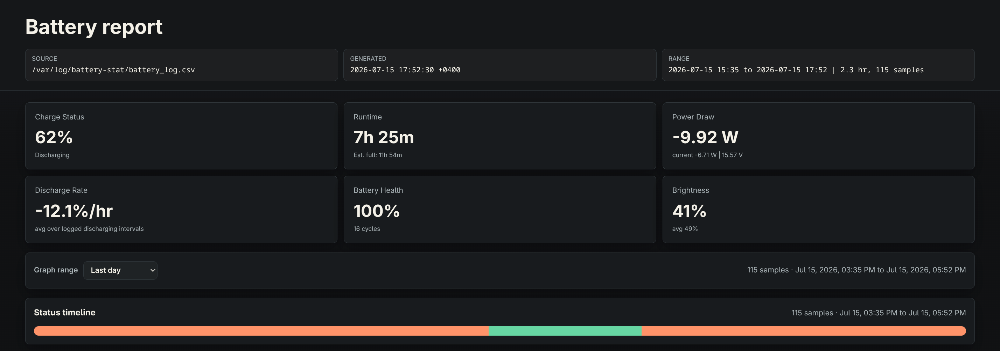
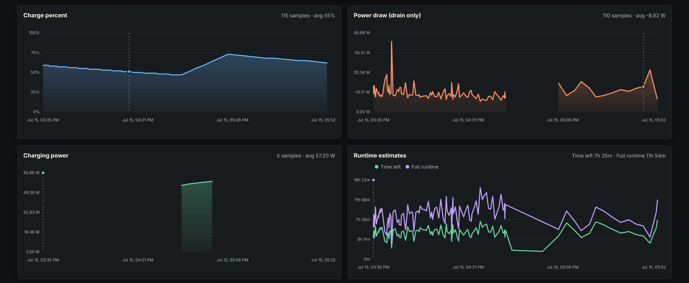

# Bat Stat

Bat Stat is a small Linux battery logger and report generator. It records battery samples to a CSV file, then turns that CSV into a dark standalone HTML report with charts, summaries, daily stats, heatmaps, sessions, and recent samples.

It is designed to run from source with Python and systemd. No Python packages are required.

## Preview





More screenshots: [health and daily summaries](screenshots/report-health-daily.png), [heatmap and sessions](screenshots/report-heatmap-sessions.png).

## Requirements

- Linux with battery data exposed in `/sys/class/power_supply`
- Python 3.10 or newer
- `git`, for the one-line installer
- systemd, if you want automatic scheduled logging

## Install

One-line install:

```sh
curl -fsSL https://raw.githubusercontent.com/riothedev/bat-stat/main/install.sh | sudo bash
```

From the project directory:

```sh
sudo ./install.sh
```

The installer:

- copies the app to `/opt/bat-stat`
- creates the command `/usr/local/bin/bat-stat`
- creates `/var/log/battery-stat/battery_log.csv`
- installs `bat-stat-log.service`
- installs and starts `bat-stat-log.timer`
- records one sample immediately unless disabled

By default, the timer logs one sample every 5 minutes.

## Generate A Report

After installing:

```sh
bat-stat
```

This reads:

```sh
/var/log/battery-stat/battery_log.csv
```

and writes `battery_report.html` in your current directory, then opens it in your browser.

Choose an output path:

```sh
bat-stat report --output ~/battery_report.html
```

Use a different CSV:

```sh
bat-stat report --input /path/to/battery_log.csv --output ~/battery_report.html
```

Skip opening the browser:

```sh
bat-stat --no-open
```

## Logging

Append one sample manually:

```sh
bat-stat log
```

Append one sample to a custom CSV:

```sh
bat-stat log --output /tmp/battery_log.csv
```

Run a foreground logger every 5 minutes:

```sh
bat-stat log --watch
```

The installed systemd timer is usually the better option for normal use.

## Timer Management

Check the timer:

```sh
systemctl status bat-stat-log.timer
systemctl list-timers bat-stat-log.timer
```

Check the latest service run:

```sh
systemctl status bat-stat-log.service
```

View logs:

```sh
journalctl -u bat-stat-log.service
```

Run one sample through systemd:

```sh
sudo systemctl start bat-stat-log.service
```

Stop scheduled logging:

```sh
sudo systemctl disable --now bat-stat-log.timer
```

Start it again:

```sh
sudo systemctl enable --now bat-stat-log.timer
```

## Installer Options

Change the logging interval:

```sh
sudo INTERVAL_SECONDS=60 ./install.sh
```

Use a different CSV path:

```sh
sudo LOG_FILE=/var/log/battery-stat/custom.csv ./install.sh
```

Install somewhere else:

```sh
sudo INSTALL_DIR=/opt/my-bat-stat BIN_PATH=/usr/local/bin/my-bat-stat ./install.sh
```

Install the timer but do not start it:

```sh
sudo START_TIMER=0 ./install.sh
```

Do not record an immediate sample during install:

```sh
sudo RUN_ON_INSTALL=0 ./install.sh
```

## Uninstall

Remove the installed app, command, service, and timer:

```sh
sudo ./uninstall.sh
```

The CSV log is kept by default. Remove it too:

```sh
sudo REMOVE_LOG=1 ./uninstall.sh
```

## Development

Run from the repo without installing:

```sh
python3 bat_stat.py --input /path/to/battery_log.csv --output report.html --no-open
```

Generate a synthetic CSV:

```sh
python3 bat_stat.py example
```

Generate a synthetic CSV and report together:

```sh
python3 bat_stat.py demo
```

Project layout:

```text
bat_stat.py
install.sh
src/
  cli.py
  constants.py
  csv_log.py
  example.py
  formatting.py
  logger.py
  models.py
  report.py
  report_template.html
  templates.py
```

The report template is `src/report_template.html`.
